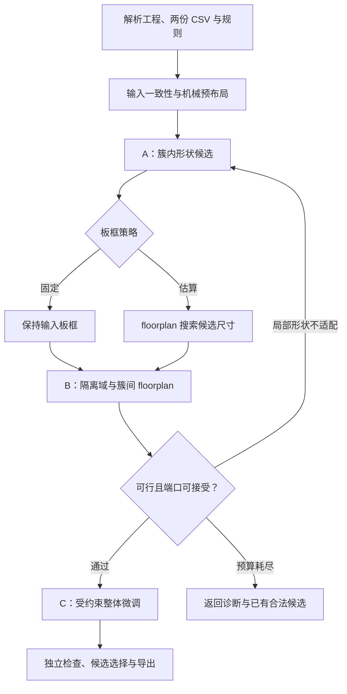

# 板级 PCB 分层自动布局：新项目构建说明与 AI 实现约束

版本：1.0｜日期：2026-09-21｜建议项目名：`pcb_hierplace`

本文依据本次提供的 `hiplace_impl.zip` 中的源码、README、CSV 规范及两份调研文档，结合项目目标和导师建议编写。它是新项目的需求与技术设计基线，不表示新算法已经实现或已在真实高低压板上验证。文中的“必须”是验收约束，“建议”是可调整的工程选择，“后续”不属于首版承诺。

## 1. 项目结论与任务边界

项目可行。建议采用**约束驱动的分层混合优化**：启发式方法处理机械锚点、接口朝向、区域和相对位置等离散决策，连续坐标仍以多项可微目标和梯度下降为核心，最终由独立几何检查确认结果满足约束。

核心流程保留为“簇内优化 → 簇间优化 → 整体微调”，但前面必须增加机械预布局和隔离域规划，簇间阶段必须能够向簇内阶段反馈尺寸、端口和空间限制。三阶段不能是只往下传递结果的一次性流水线。

“多项优化函数”在本文中解释为多个目标项构成的优化模型，不要求每一项都是代数多项式。平滑 HPWL 的 log-sum-exp、softplus 等仍符合可微优化路线。若研究任务明确要求严格多项式模型，应另行规定代理函数，不能将两者混称。

首版目标是：给定一个 PCB 的几何、引脚级网络、隔离域标签和功能簇标签，产生满足已配置布局约束的器件位置、方向及验证报告。输出作为后续布线的起点。最初的性能验证规模建议覆盖 30、100、300 个器件，以及 5～30 个功能簇；这只是基准规划，不是性能保证。

不把自动布线、电磁仿真、完整热设计、3D 机械校验和产品安规认证纳入首版。HPWL、拥塞代理、二维导体间距均须按各自含义报告，不把它们解释为实际走线长度、可布通证明或完整安规通过。

### 1.1 导师建议对应的具体设计

| 建议 | 本项目中的落实方式 | 禁止的替代做法 |
|---|---|---|
| 启发式先满足固定孔、接口等硬约束 | 区分绝对固定、沿边可动、区域可动和普通器件；先选合法边及朝向，再安排位置 | 按 `J/H` 前缀全部锁死，或全部搬到板边 |
| 用 floorplan 解决高层布局 | 用功能簇形状候选、水平/垂直约束图和离散拓扑搜索；固定拓扑下做投影梯度优化 | 只给簇中心加斥力，称之为完整 floorplanner |
| 有固定板框就始终在其内优化 | 固定边界进入预布局、簇间模型、合法化和微调；失败回退，禁止扩板兜底 | 最后把输出板框改回原值，但优化过程实际按更大板框运行 |
| 无板框时先估算 | 用局部形状和 floorplan 估算候选板框，寻找可行尺寸；选定后冻结并微调 | 直接把初始散乱器件外接框当作真实板框 |
| 多目标必要时分级 | 可行性优先，关键电气意图其次，线长与形状分级；采用性能预算保护高优先级目标 | 所有项固定加权后只比较一个总损失 |

安装孔不必天然在板边。已有机械坐标是绝对约束；尚未确定的孔位只能在明确给定的机械模板中选择。接口“方向正确”必须由插接面、出线方向或封装局部方向向量定义，不能仅根据旋转角猜测。

### 1.2 首版支持范围

| 维度 | 首版要求 | 后续扩展 |
|---|---|---|
| 板框 | 单个矩形固定板框，或无板框时估算矩形；保存原始几何 | 凹多边形、曲边及复杂开槽的完整优化 |
| 障碍 | 固定器件、孔位及显式矩形禁布区；孔可用保守矩形包络 | 多边形自由空间分解及非凸约束 |
| 安装面 | 单面可动器件；通孔障碍跨面生效 | 完整双面密度、翻面和跨面隔离 |
| 方向 | 每器件显式允许角度集合；至少支持正交方向并保留合法原角度 | 连续角度或更复杂旋转搜索 |
| 功能簇 | 每簇在一个隔离域内；跨域功能关系保留为上层逻辑组 | 非矩形互嵌簇、自动拆簇 |
| 隔离 | 两个主隔离域、显式间距规则、跨域器件模板、二维导体检查 | 多域区域图、表面路径爬电分析 |
| 布线 | 面向未布线输入；保留网络 | 带布线迁移及重新布线联动 |
| 格式 | 经过测试夹具验证的 `.epro2` 版本与单板选择 | 更多格式版本、更多导入导出后端 |

超出首版范围时返回 `UNSUPPORTED_FEATURE` 并说明对象和原因；不得忽略底层器件、删除内孔，或把凹板框改成矩形后继续声称原板合法。可提供显式研究模式，但必须独立标识，不能产生生产导出。

## 2. 参考工程中应保留与应重建的内容

### 2.1 可保留的设计思想

原工程已有规范化数据模型、焊盘级平滑 HPWL、簇内候选形状、多起点、器件与簇的方向枚举、三阶段流程、结果可视化和最小化写回的思路。它们可作为新项目参考。原来的梯度校验方法也应继承。

新项目应分离格式适配、不可变输入模型、候选布局状态、约束编译、连续求解、离散搜索、独立验收和工程写回，避免直接复制 `stages.py` 与 `pipeline.py` 后不断追加配置开关。

### 2.2 本次代码核对发现

下表中的路径均相对于压缩包内 `hiplace_impl/`。问题判断以实际代码为依据；“缺失”表示新需求未实现，不代表原项目曾承诺支持。

| 编号 | 依据与现状 | 对新项目的要求 |
|---|---|---|
| R01 | `clusters.py`、`pipeline.run()` 只有一个功能分簇入口；没有隔离域模型 | 两份 CSV 独立读入，增加隔离规则，不复用 `cluster_gap` 冒充高低压间距 |
| R02 | `stages.legalize_floorplan()` 无条件重新生成板框，且用于推挤的数组只有簇块；`build_global_model()` 使用该板框加增长容差 | 原板框、固定障碍必须进入每一级可行域；不能只在最终输出恢复 fixed 板框 |
| R03 | `legalize_components()` 失败后存在放开边界和径向膨胀路径 | 固定板框模式禁止此兜底；返回最近合法候选或搜索失败 |
| R04 | `legal.count_overlaps()`、`push_apart()` 用 `ovx > gap && ovy > gap` 判违规 | 该 `gap` 实际容忍小重叠，未保证最小间距；重写为明确的间距规则与距离检查 |
| R05 | `model.py` 的增长项将完整 `Wk*Hk` 与 `hw0*hh0*(1+eta)` 比较，`stages.py` 传的是半宽半高 | 基准面积少了 4 倍；统一完整宽高，增长阈值用 `w0*h0*(1+eta)` |
| R06 | `optimize.run()` 在更新前求 `c`，更新后保存 `z`；跨不同 gamma 比较 best；投影后未更新返回评分 | 候选、目标版本和评分原子保存；固定评估口径后再跨阶段比较 |
| R07 | `canon.Component.bbox_abs()` 以参考点为包络中心，只保留旋转后宽高 | 非对称封装的包络会平移错误；必须变换完整局部几何，保留参考点到几何中心的偏移 |
| R08 | `lceda.build_canon()` 在源单位下加 `bbox_margin`，之后统一缩放；无焊盘的 `±1` 占位也再缩放 | 声称 mm 的参数必须在换算后应用；无几何时不能用失真的极小占位继续优化 |
| R09 | `solve_cluster_a()` 修改共享 `Component.rot`；候选之间共享状态；`pipeline` 的 before 在这些修改之后构造 | 输入姿态不可变，候选各自保存方向；初始基线在任何优化前冻结 |
| R10 | Stage A 只看 `graph.intra_nets`；跨簇网中同簇多个引脚的局部连接被漏掉 | 每条网都提取本簇引脚子集；外部引脚由端口目标或反馈处理 |
| R11 | `select_shapes()` 名为 Pareto，实际执行面积排序、几何去重及长宽比抽样，没有完整支配判定；Stage A 未用 `push_apart` 的 `ok` 拒绝非法形状 | 实现合法性过滤与真实 Pareto 保留；形状必须携带内部合法性和端口信息 |
| R12 | 固定件既能以 `c_fix_*` 出现在簇候选，又作为固定器件块加入 Stage B；其中簇块被设为可动 | 消除固定实体重复建模；固定物理对象仅出现一次，逻辑归属另存 |
| R13 | `build_global_model()` 的 `w_region=0`；`evaluate.ok` 不包含区域违规；`fixed_pair_overlaps` 传全 false movable mask，统计结果被全部排除 | 所有硬规则进入独立检查；固定件既有冲突也必须报告，不能以“不可动”为由忽略 |
| R14 | 板框解析只保留最大环，拼接失败时可能取凸包；优化与验收主要基于 bbox；碰撞模型无完整层语义 | 几何不支持就阻断；保留外环、孔洞、安装面与障碍适用层 |
| R15 | 默认根据 `J/H` 前缀固定原位，没有插接方向或沿边约束 | 前缀只能辅助生成待确认规则，不能替代机械约束 |
| R16 | `apply_placements()` 只写 COMPONENT，派生板框没有写回；README 也注明尚未在立创EDA本体实测 | 位姿正确、板框一致、原生软件可打开必须分别验收 |

上述问题不能全部归因于“分层方法天然不如人工”。矩形簇保守性确实可能降低密排能力，但当前实现还存在几何、边界和评分问题，应先修正再比较算法效果。README 中真实板的劣化结果不足以证明原板面积理论上不够：启发式失败不等于问题无解。

### 2.3 本次实际验证及证据边界

运行参考工程原有 `tests/test_gradients.py`，12 组检查通过，最大相对误差约 `6.408e-09`；运行 `tests/test_e2e.py`，脚本报告 `75 passed, 0 failed`。其中独立 KiCad 解析器缺失时的分支被脚本记作通过，不能据此宣称已完成第三方交叉验证。

另作了两个小型几何反例和一个优化器检查：

| 检查 | 输入及观察 | 结论 |
|---|---|---|
| 间距判定 | 两个宽 2 mm 的块，中心距离 1.98 mm，实际重叠 0.02 mm；`gap=0.05` 时返回 0 对 | 原检查会漏报浅重叠 |
| 最小间距 | 同样的块，中心距离 2.02 mm，间距仅 0.02 mm；要求 0.05 mm 时仍返回 0 对 | 原函数不能作为最小间距验收 |
| 非对称包络 | 参考点在原点、局部包络 `(0,0,4,2)`，返回包络 `(-2,-1,2,1)` | 几何偏移丢失 |
| 评分一致性 | 两步固定 gamma 的 GD 小例子，返回评分 `11.186423`，对返回坐标重新计算为 `11.081447` | 候选与评分确实不一致 |

梯度差分测试通过只说明实现与当前公式在测试点一致，不说明公式的物理含义、单位、硬约束语义和流程正确。此包主要提供合成 demo；没有对真实高低压板完成新路线的运行验证，文档不编造改善比例。

## 3. 输入契约：三项设计输入与一份规则配置

正式运行的三个设计输入为 `board.epro2`、`voltage_domains.csv` 和 `functional_clusters.csv`。另外必须有 `constraints.yaml` 或等价 JSON，用来表达两个 CSV 无法提供的机械意图、允许朝向和隔离距离。规则配置不是第三份分簇文件。

### 3.1 `.epro2` 解析要求

必须提取选定 PCB 的器件 UUID、位号、初始位姿、安装面、锁定状态、封装几何、真实焊盘几何与网络、板框、孔及禁布区。多板工程必须指定唯一板 ID；歧义时不默认选择器件最多的板。

参考项目展示了一种 `.epru` 日志解析及高 ticket 写回方式，不能将它假设为所有立创EDA版本的完整格式规范。适配器应声明已测试版本，保存原始记录，明确同 ticket、删除记录、文档切换和未知类型处理规则。对影响几何或网络但尚不理解的记录，应停止并报告，不得猜测删除或复活语义。

单位优先根据已验证格式和元信息确定；无法确定则要求 `source_unit` 显式配置。板尺寸合理性只能做异常检测，不能静默改用另一套比例。转换到 mm 后再添加 mm 间距。内部统一 `x` 向右、`y` 向上、逆时针角度为正，源坐标变换仅在适配层执行。底面镜像即使暂不支持也必须被识别，不能套用顶面公式。

必须区分 `outline_present=true/false`。未发现板框不等于板框为初始器件外接框；开环、坏环和格式不支持也不等于无板框。

已有布线、铺铜或过孔时，不能只移动器件而让旧导体留在原处。首版检测到受影响的已有布线后，正式优化/写回返回 `ROUTED_INPUT_UNSUPPORTED`；研究分析模式可只输出诊断。未来若支持显式清理或布线迁移，应有独立策略及完整变更记录。

### 3.2 隔离域 CSV

隔离域表示电气隔离关系，不只是电压数值。例如 12 V 原边和 12 V 副边也可能需要隔离；“低压”域不能仅凭字符串 LV 推定为安全可触及域。

最小格式：

```csv
designator,domain_id
J1,HV
Q1,HV
C1,HV
U1,LV
C2,LV
U2,BRIDGE_HV_LV
H1,MECHANICAL
```

`domain_id` 为规则文件中声明的任意 ID。桥接标签必须匹配显式桥接模板；机械标签不参与功能网优化，但其孔位、净空和导电性仍需配置。可选列为 `component_uuid`、`note`，不通过可选列暗中覆盖已锁定坐标。

首版所有参与布局的器件均应有明确分类，缺项、重复位号、未知位号和未声明域默认报错。使用 UUID 时必须与选定板中位号交叉校验；出现冲突不按某一字段静默覆盖。

### 3.3 功能簇 CSV

```csv
designator,cluster_id,cluster_name
J1,input_power,高压输入
Q1,switch_power,开关功率级
C1,switch_power,开关功率级
U1,controller,低压控制
C2,controller,低压控制
U2,isolation_link,隔离接口
H1,mechanical,机械安装
```

每个器件恰好属于一个逻辑功能簇。固定件可以在逻辑上属于该簇，但不能因此被当作可自由平移的宏块成员。物理优化簇与逻辑功能簇必须分别记录。

默认要求一个普通物理簇只属于一个隔离域。跨域逻辑簇采用以下显式策略之一：

1. `error`：默认策略，提示成员和对应域。
2. `split_by_domain`：用户配置允许后按 `(cluster_id, domain_id)` 分为物理子簇，保留父级逻辑组，报告拆分结果。
3. `bridge_template`：隔离变压器、光耦、数字隔离器等使用已声明模板；一个器件不可拆成两个可独立移动的实体。

固定孔、完全固定的连接器不要求与其逻辑簇共同平移。普通簇内“布局在一起”的默认可验收含义是：成员占位完整落入同一合法簇区域，区域有明确尺寸/填充率或最大直径限制；固定锚点例外通过附件簇与连接约束表达。不能仅用一个会退火到很小的凝聚力系数解释“同簇聚集”。

### 3.4 必须补充的机械规则

| 模式 | 优化变量 | 规则含义 |
|---|---|---|
| `fixed_pose` | 无 | 位置、方向和安装面均保持给定值；默认保留源文件 locked 器件 |
| `edge_slide` | 沿指定边的一个标量 `s` | 插接面/安装基准相对板边固定，沿合法边段移动，方向按模板确定 |
| `region_bounded` | 区域内 x/y，允许角度集合 | 完整占位留在指定可行区域内 |
| `free` | x/y 和允许的离散角度 | 在所属域、簇和板内移动 |

允许 `edge_choice` 在若干显式许可板边中离散选择，然后转为 `edge_slide`。接口规则至少含局部插接方向向量、边界基准点、允许边段、外伸许可、板内焊盘要求及插拔禁布区。用向量与板边外法线的关系验证朝向，不把“90°就是向外”写死。

锁定规则不一致时报 `CONSTRAINT_CONFLICT`。解锁必须由明确的 `unlock_source_locked` 对象列表表示；不得让 CSV 的 `fixed=0` 或通用默认值解除源锁定。

未给允许朝向时，默认只保留源角度；增加 90°/180° 等候选必须由器件规则或已确认的封装规则允许。簇级朝向须使所有成员变换后的方向都合法，不是任意簇都能整体转四个方向。

## 4. 隔离模型：区域预留、导体检查与验证边界

两份 CSV 提供“谁属于哪一域/簇”，并未提供足够信息来确定安规距离。距离必须来源于设计者选定的规则包，记录适用标准及版本、工作电压、绝缘类别、污染等级、材料组、海拔等适用条件。软件只执行配置，不根据 HV/LV 标签自动猜数值。

电气间隙是导体之间最短空气距离，爬电距离是沿绝缘表面的最短路径，二者定义及影响因素不同。[TI：Demystifying Clearance and Creepage Distance for High-Voltage End Equipment](https://www.ti.com/lit/pdf/slup419) 可作为背景依据；本文不替用户指定标准版本或距离值。

### 4.1 三种距离各自建模

| 字段 | 作用对象 | 用途 |
|---|---|---|
| `mechanical_gap_mm` | 器件本体/courtyard 等装配占位 | 机械与装配避让 |
| `copper_clearance_mm` | 指定导体组的铜几何 | 已配置二维铜间距检查 |
| `creepage_mm` | 指定导体之间的绝缘表面路径 | 完整模型或外部验收；首版不得以器件中心距替代 |
| `routing_reserve_mm` | floorplan 域边界和通道 | 布线余量，独立于上述间距 |

域间区域预留是保守设计手段。首版可规定普通高压/低压器件的本体和对应导体包络分别留在两个不重叠区域内，中间预留隔离带；仍必须在输出上检查实际焊盘导体几何，不能只看簇中心或区域中心。

凡是与外界或另一隔离域有关的导体，都必须有明确归属。包括未连接的金属焊盘、屏蔽壳、金属孔和机械件，不能因无网络名就自动免检。对同一 net 同时出现互相隔离的域，默认视为输入冲突；若设计确有特殊连接关系，必须由规则文件声明其电气语义。

### 4.2 跨隔离器件

`U2` 之类的桥接器件只有一套物理位姿，但其焊盘需分别归属 HV、LV 或其他已声明域。模板必须定义每个焊盘组、隔离轴/屏障位置、允许方向、隔离带处的本体许可和必要禁布区。

合法性要求包括：HV 焊盘在高压侧、LV 焊盘在低压侧、允许朝向满足、两侧导体满足所配间距、周围器件不侵入模板禁区。不得为“桥接器件”取消所有域间检查；封装自身无法达到所配条件时应报模板冲突，而非靠旋转掩盖。

首版若没有桥接模板，应对含跨域器件的正式运行报 `BRIDGE_TEMPLATE_REQUIRED`。这比把光耦整体塞进 HV 或 LV 更符合实际物理结构。

### 4.3 报告声明

首版报告用 `placement_rule_status`、`copper_spacing_status`、`creepage_status` 分别表达结果。二维包络或平面焊盘间距验证通过，只能说明在已声明模型范围内通过。

未建模开槽表面路径、封装立体表面、爬电路径或未来布线时，`creepage_status=NOT_EVALUATED`，`safety_signoff=NOT_PERFORMED`。不得输出 `safety_passed=true`。完整认证不属于本项目产物，但配置中的高低压几何隔离约束必须在每个可交付布局中满足。

## 5. 统一数据模型与约束架构

### 5.1 不可变输入与候选状态分离

| 对象 | 至少包含 |
|---|---|
| `BoardSpec` | 板 UUID、源格式版本、原始/归一化坐标变换、原始外环/内环、outline_present、板框模式、源文件哈希 |
| `ComponentSpec` | UUID、位号、源位姿、层、局部本体/courtyard、焊盘几何、孔、允许朝向、运动模式、逻辑簇及域 |
| `NetSpec` | 稳定 net ID、全部 pad ID、显式权重和网络类别；不能以 fanout 大就推定电源网 |
| `ConstraintSet` | 固定、板内、障碍、间距矩阵、隔离、边约束、簇区域、电气距离、层规则及来源 |
| `ShapeCandidate` | 成员相对位姿、完整包络、端口、可用朝向、内部指标、验证结果和哈希 |
| `PlacementState` | x/y/方向/层、簇候选 ID、域布局、拓扑、板框候选 ID；不可变输入不被覆盖 |
| `CandidateRecord` | state、目标版本、归一化尺度、精确指标、硬违规清单、种子和父候选 |

不得让封装实例共享可变 pad/net 数据；可以共享不可变几何模板。不能在评价一个候选方向时修改输入 `ComponentSpec`，再依赖手工恢复。

### 5.2 几何坐标原则

器件参考点 `t_i` 不等于几何中心。焊盘位置与本体几何均使用同一刚体变换：

\[
q_{ip}=t_i+R(\theta_i)u_{ip}.
\]

局部几何可在实现中重心化，但必须同时保存原始参考点偏移及其逆变换，以保证写回准确。旋转后重算本体、焊盘、孔和方向向量；不得只交换宽高而遗漏端口与偏心。

首版可在求解时使用保守 AABB，但 AABB 必须完整包含实际几何，并标明保守程度。候选朝向不是 90° 倍数时，应由实际旋转后的顶点计算包络，不能自动四舍五入。几何来源不明时不得把焊盘包络视为可靠本体；需用户提供 courtyard/body 或显式批准的占位配置。

### 5.3 硬约束与软目标分开

硬约束包括板内、固定姿态、边方向、允许角度、不可重叠、机械间距、域隔离、障碍、指定簇区域以及声明为硬约束的器件邻近/顺序关系。软目标包括普通网络线长、形状偏好、原布局扰动和非强制紧凑度。

一个硬条件可以同时有可微罚项用于寻找可行方向，但**罚项小不能替代可行判定**。`ConstraintSet` 是唯一规则来源；每条规则暴露 `id`、涉及对象、阈值、求解表示及精确检查。评价器独立于优化损失实现，不能直接将 penalty 是否小于阈值当作验收。

对于矩形且固定方向的块，完整占位在板内可写为：

\[
x_{min}+a_i\le x_i\le x_{max}-a_i,\quad
y_{min}+b_i\le y_i\le y_{max}-b_i.
\]

这里的 `x_i,y_i` 是对应包络中心，`a_i,b_i` 是半宽半高，必须由正确的参考点变换得到。区间上下界交叉时直接报告当前形状放不下，禁止交给 `clip()` 伪造坐标。

两个块的无重叠/轴向保守间距为四选一的析取条件，例如：

\[
x_j-x_i\ge a_i+a_j+g_{ij}.
\]

其余三种为右、上、下关系。离散层选择其中一种后，该约束在线性坐标空间内成立；不是把四个方向全部要求成立。对角摆放的真实最短距离由精确检查处理，轴向约束是保守可行子集，不代表所有可行布局。

固定件也属于碰撞及间距检查对象。两个固定件互相冲突时报告输入冲突，不能因两者均不可动而剔除。

铜间距检查按规则定义的导体对执行：同一连续铜对象不和自己比较，同网合法连接不套用异网短路间距；但同网若跨越被声明互相隔离的域，先报告电气归属冲突。封装内部已定义的合法焊盘关系与封装外部器件间距应分别配置，不能用一个全局机械间距去检查所有焊盘。

## 6. 总体技术路线与阶段契约



### 6.1 P0：读入、规则编译与可行性预检查

输入：原工程、两份 CSV、约束文件。输出：`normalized_design.json`、`compiled_constraints.json`、`input_diagnostics.json`、不可变原始布局快照。

检查至少包括：器件映射全覆盖、网络及 pad ID 一致、源单位确定、几何有效、板框有效、源锁定冲突、两份 CSV 一致、隔离域关系、桥接模板、允许角度以及固定障碍冲突。

可行性检查采用有条件的必要条件：例如同面不可重叠真实占位的总面积是否超过可用板面积、一个候选器件是否能以某个允许角度进入目标区域、强制相对位置图是否存在冲突环。矩形包络面积之和大于板面积可能只证明该保守模型失败，不一定证明实际几何无解。报告必须写明证据适用范围。

P0 不凭利用率阈值断言可行：总面积够用不代表固定障碍之间放得下，也不代表连接器有足够边段。

### 6.2 P1：启发式机械预布局与隔离域粗规划

处理顺序建议为：绝对固定件 → 孔及全层禁区 → 接口/沿边器件 → 桥接器件及隔离方向 → 普通功能簇区域。

绝对固定件直接进入障碍集合，绝不投影到最近板边。对沿边器件，依据允许边段、插接方向和禁区生成有限候选；按可选位置少、尺寸大、连接要求强的顺序放置，冲突时局部回溯。候选评分可考虑相连簇的预计距离、剩余边段碎片和对隔离域的限制。启发式只能寻找可行机械布局，不能保证所有输入均可解。

首版 HV/LV 粗规划枚举左右、右左、上下、下上四类隔离拓扑。选择与固定件及接口兼容的候选，并在中间预留隔离带；分割线位置在合法范围内搜索。隔离带宽度由规则包和布线余量编译得出，不是统一常数。桥接器件放在满足模板方向与焊盘分侧条件的隔离界面位置。

若现有固定件分布与任何直线分区都不兼容，首版返回“当前分区表示无可行候选”，允许以后采用多区域表示；不能因此移动固定件或删除隔离带。

无板框模式下，预布局先建立机械模板和相对规则；接口的“位于哪条板边”要随候选板框重新实例化。不得先按临时板框锁死接口，再扩板后声称它仍在边上。已有绝对机械坐标始终保留，候选板框需包容它们。

本阶段仅保证已经放置的机械对象满足其硬规则，并为后续搜索提供边界条件；它不声称在普通器件尚未布局时已经满足全板所有硬约束。

### 6.3 Stage A：簇内优化，生成真实可落地的形状

**变量：**簇内普通器件相对 x/y；允许方向由外层枚举/局部搜索选择。每个候选内部仍以梯度方法优化。

**目标：**局部引脚线长、关键邻近关系、适度紧凑度与目标长宽比；硬约束为内部不重叠/间距、成员合法方向、局部区域和机械模板。以少量可解释目标启动，暂不加入无明确作用的空洞覆盖项。

对每个簇生成若干长宽比、朝向及初始布局候选。第一候选尽量复用原布局；额外候选可用网表启发式与确定性打散。每次方向变化后重建该候选的全部几何和焊盘偏移。

对跨簇网络，不可简单从 Stage A 中删除：当一条网有两个以上本簇引脚时，应保留该局部子集的连接代价；外部连接通过边界端口目标表示。首次可用外部锚点或粗方向，Stage B 后再反馈真实外部端口。局部代理分数只用于候选生成；最终全板每条原始网络只计一次。

固定对象只建模一次。与固定芯片/接口相关的功能簇采用“固定锚点＋可动附件簇”，保持逻辑关联；附件簇局部求解时纳入锚点端口和障碍。多个相距很远的固定锚点不能强行塞入一个可平移矩形，需显式拆分附件簇或使用锚定子问题。

每个 `ShapeCandidate` 至少包含：

- 可动成员的相对位姿、实际宽高和保守占位轮廓。
- 外连端口的真实 pad ID、局部坐标及 net ID；不是只有一个簇中心。
- 内部加权/非加权 HPWL、紧凑指标、允许簇级旋转集合。
- 精确内部检查结果、几何来源、规则版本、随机种子。

只有内部合法候选能进入 B。面积、内部线长、长宽比适配性、外部端口特征可用于 Pareto 保留；同样宽高但端口在不同边的形状不能去重成一个。非支配筛选之后再限制候选数，首版可从每簇最多 4 个开始，预算写入配置并报告。

形状是刚体内部布局，不允许在 Stage B 为达到目标宽高而连续拉伸其成员、焊盘或封装。需要另一个长宽比时，回到 A 在新的形状预算下重新求解。

### 6.4 板框模式

只保留清晰的 `fixed`、`estimated` 与入口解析值 `auto`，首版取消语义模糊的 hybrid。

| 模式 | 选择条件 | 不变量 |
|---|---|---|
| `fixed` | 明确配置，或 auto 下存在有效原板框 | 原几何在全过程不变；不优化板面积、不自动增大边界 |
| `estimated` | 不存在板框要求，或明确允许替换现有板框 | 先搜索可行板框，再冻结进入最终微调 |
| `auto` | 配置省略时的入口值 | 有有效板框解析为 fixed；确实无板框解析为 estimated；坏板框报错 |

估算初值可采用：

\[
A_{guess}=A_{occupied}/u_{target}+A_{reserve},\quad
W_0=\sqrt{r A_{guess}},\quad H_0=\sqrt{A_{guess}/r}.
\]

`A_occupied` 必须清楚采用何种占位，固定件不能重复计数；`A_reserve` 含隔离带、路由和机械余量，若隔离带面积依赖 W/H，则随候选尺寸更新。该公式是初值估计，不是面积下界或可行证明。

随后对若干候选长宽比运行约束 floorplan，在允许尺寸范围内扩展直到找到合法候选，再做有预算的缩小搜索。启发式失败不能作为严格单调的不可行判定，因此不能声称简单二分必然求得最小面积。每次改尺寸都要重建沿边接口和分区，保存最小的已验证合法候选。

确定板框后将其冻结为本轮 C 阶段硬约束。若必须重新估算，回到显式外层迭代并生成新的板框候选 ID；禁止 C 在末尾悄悄扩大外接框。

### 6.5 Stage B：簇间 floorplan 与连续优化

**离散变量：**域拓扑、簇形状 ID、簇允许方向、必要的相对位置关系及接口候选。**连续变量：**簇中心、沿边参数；在域拓扑固定的子问题内，可包含受限分割线位置。首版可先离散采样分割线，减少实现复杂度。

推荐首版统一使用**水平/垂直约束图**作为 floorplan 与合法化的中间表示。不要求同时实现 B*-tree、序列对、遗传算法和粒子群。初始相对关系可由启发式装箱、原布局或序列对产生，但都必须编译到同一个约束系统。

对于当前选中的矩形宏块与固定方向，在每一对需要分开的块/障碍之间选择一个可行的左右或上下关系，写成线性不等式。加上固定坐标、板边界、域边界和接口约束，得到：

\[
\mathcal C(T,S)=\{z:Az\le b,\ Ez=f\},
\]

其中 T 为离散拓扑，S 为形状和朝向选择。包含关系是全体约束的交集，不能只保证水平图或垂直图分别无环就认定全局可行；还需检查上下界与固定坐标的一致性。

在这一可行域上，用投影梯度下降或投影 Adam 优化焊盘级平滑线长：

\[
\tilde z=z_t-\eta_t d_t,\qquad
z_{t+1}=\arg\min_{z\in\mathcal C(T,S)}\tfrac12\|z-\tilde z\|_M^2.
\]

`d_t` 为梯度或 Adam 方向，M 为正定对角位移代价；投影是小型凸 QP，不承担原始全局布局目标。这样核心位置优化仍是梯度方法，同时每个已接受状态具有明确的线性可行域。投影失败时拒绝该步/拓扑，不改规则。

使用稀疏 QP 求解器是建议实现方式，例如 OSQP；具体版本在实现阶段通过环境验证锁定。不得把不收敛返回值当作投影成功，必须检查状态和约束残差。低精度解应收紧裕量后重试，最后由独立几何检查决定是否接受。

上述 QP 只负责已编译为线性的子集。实际 pad 距离、面积增长或欧氏最大距离等未必是线性条件，不能直接塞进 `Az≤b`。首版应采用明确的保守线性表示，或在投影后精查并回溯；每条规则记录采用哪条路径。若拒绝导致停滞，则回到离散搜索或报告未改善，不能宣称线性投影已经保证所有非线性硬条件。

外层用有预算的局部搜索/小束搜索改变拓扑、形状或方向；每次先验证可行性，再运行短梯度优化。必要时可用小规模 MILP/CP-SAT 诊断局部堵塞，但不让其取代全部梯度内核，也不把超时解释成无解。

Stage B 的线长使用簇内部实际 pad 偏移做刚体变换，不能全部收缩成中心点。同一原始多引脚网保留为超边，不随意展开全连接两两网而改变权重。

固定板框下不加入“板面积最小化”目标，因为板面积已经是常数。可以优化布局占用范围或簇空白，但必须命名为对应指标，且不得挤占已声明的通道。

### 6.6 A′：受约束的簇内反馈

B 得到区域、朝向和外部端口分布后，为受影响的簇重新生成局部布局：保持其域、机械约束和当前分配区域，加入外部端口目标，再优化内部器件。

若 A′ 改变了实际形状或端口，必须更新候选哈希、簇尺寸、pad 偏移和约束图，并重新运行局部 B 检查；不能仅改 `w/h` 缓存。首版可限制 A↔B 反馈最多 3 轮，并保留上一轮合法完整布局。没有改善或时间耗尽时停止，禁止无限循环。

### 6.7 Stage C：受约束整体微调

C 的输入必须是展开后已通过全板检查的 B/A′ 布局。若 B 尚不合法，不得把全部问题交给 C 再从头摊平。

首版 C 只优化普通器件 x/y，冻结方向、安装面、隔离域拓扑、已选板框及机械接口；先在各自簇区域中进行小位移优化。约束包含所有固定物、板内、机械间距、跨域导体规则、簇区域及关键电气硬条件。

投影/合法化沿用统一约束体系。局部相对关系阻塞改进时，由外层有限窗口重新选择分离方向，再恢复连续优化，不采用无边界全板推挤。

“微调”必须有量化定义：每个器件相对 C 输入的最大位移 `trust_radius_mm`，以及簇面积或直径增长上限。超过信赖域的改善应交给 B/A′ 重排，而非继续叫微调。簇凝聚力可保留为软项，但硬域和簇区域不随退火消失。

后续可支持同域相邻簇的边界调整以提高密排能力，但需先更新双方区域、重新验证成员归属与尺寸，再接受。首版不允许普通器件自由跨簇漂移。

每个合法候选均与当前最佳候选按统一优先级比较。C 失败或损害高优先级指标时回退到其合法输入，仍可输出 `FEASIBLE` 并说明“微调未改善”，不能交付更差的非法状态。

## 7. 可微目标、分级优化与稳定选解

### 7.1 平滑焊盘线长

对网络 e 的真实焊盘坐标定义：

\[
W_\gamma(e)=\gamma\left[
\log\sum_{p\in e}e^{x_p/\gamma}+\log\sum_{p\in e}e^{-x_p/\gamma}
+\log\sum_{p\in e}e^{y_p/\gamma}+\log\sum_{p\in e}e^{-y_p/\gamma}
\right].
\]

用数值稳定的 log-sum-exp 实现。网络权重由规则明确提供；未知网络默认普通信号，不因名称片段或 fanout 自动大幅降权。电源网总 HPWL 可降权，但去耦、开关回路等独立意图仍须保留。

簇内可使用内部网和外部端口的代理；跨簇阶段可只优化会随簇位置变化的部分；最终验证始终用完整原始网络集计算真实 HPWL，各网络只计一次。

### 7.2 可行性搜索辅助项

对约束残差 `g_k(z)≤0`，可采用平滑罚项：

\[
P_k(z)=\left[\tau\log(1+e^{g_k(z)/\tau})\right]^2.
\]

所有长度残差先按固定参考长度归一化。非凸几何距离或矩形重叠公式只在其光滑区可微时，应称分段可微；测试要覆盖接触、完全重叠和包含情形。完全重合可能导致零分离方向，必须用离散初始化、确定性打散或约束图解决，不依赖加大权重。

首版主路径在固定拓扑的可行域内运行，罚项只辅助生成候选或局部修复。几何合法性由投影、离散选择和精确检查共同维护。

### 7.3 功能簇与关键电气项

可定义形状保持项：

\[
L_{coh}=\sum_c\frac{1}{|c|L_0^2}\sum_{i\in c}
\|(p_i-\bar p_c)-u_i^{ref}\|_2^2.
\]

该项平移不变，但不是隔离域约束。簇区域约束需包含完整器件占位，不只检查器件中心。候选实际面积增长限制使用 `A_c≤(1+eta)A_c_ref`，完整宽高必须一致。

关键引脚对、去耦距离、功率回路等只在规则明确指定时建模。首版可以实现 pad-to-pad 最大距离和有向顺序；不得根据位号自动臆测一条功率回路。任何“电气优化”都应注明是布局代理。

### 7.4 目标归一化

用固定输入尺度归一化，例如 `L0=参考板对角线`，`W_hat=W/(L0*sum(net_weights))`，位移项除以 `L0²`，面积项除以固定 `A0`。无板框时参考尺度从确定的首个估算初值取得并记录，不能随优化缩板不断变化。

目标及梯度量级、每项未加权值、加权值、约束残差和当前调度参数均写入日志。不能只输出 total 而无法解释下降来源。

### 7.5 分级优先级

| 优先级 | 固定板框 | 估算板框 |
|---|---|---|
| P0 | 全部配置硬约束可行 | 全部配置硬约束可行 |
| P1 | 关键电气软目标；声明为硬规则的仍属 P0 | 同左 |
| P2 | 真实加权 HPWL | 默认先板面积，或由显式策略改为先线长 |
| P3 | 簇形状/紧凑度和软布线代理 | 默认在面积预算内优化 HPWL |
| P4 | 原布局扰动及确定性平局处理 | 同左 |

优先级不是“把 P0 权重设到 1e12”。先得到合法解，再针对当前层级做优化，同时维持更高层级的性能预算：

\[
f_j(z)\le f_j^*+\epsilon_j\quad(j<k).
\]

首版可采用候选筛选实现该预算：低优先级搜索产生候选后，重新计算高层指标；超过预算则拒绝/回溯，不更新 incumbent。无需一开始把所有预算写成复杂非线性投影。预算必须是显式绝对值或相对值，其尺度和默认策略写入配置。

当多个布局数值近似相等时，分级只能规定选择偏好，不能保证数学唯一性。对称电路可能存在等价最优解，非凸搜索也会产生不同局部最优。先比较硬可行性，再比较高优先级指标；在允许数值容差内平局时，按较小扰动、较少旋转、稳定 UUID 排序和固定种子确定结果。不要求不同种子必须产生不同结果。

### 7.6 优化器必须遵守的实现细节

1. 每个 `CandidateRecord` 的坐标、方向、几何版本、目标版本及评价结果必须来自同一次求值。
2. gamma、权重、尺度或约束改变后，旧 total 不可直接与新 total 比较；统一用独立精确指标和优先级选解。
3. 完成梯度步、投影、旋转、合法化、坐标取整之后，都要对实际状态重新计算评价。
4. 方向、变量维度或拓扑变化时重置受影响的动量；拒绝候选时恢复 optimizer state，不能只恢复坐标。
5. NaN/Inf、投影失败、严重残差、未知求解器状态均触发拒绝、缩步或诊断，不能向下游传播。
6. 保留 `best_feasible` 与 `best_search_state` 两套状态。后者可能非法，不能导出为成功结果。
7. 在单线程、固定依赖及相同种子条件下要求容差内可复现；跨平台不强制浮点字节完全一致。

推荐首版用 PyTorch float64 自动微分降低手写梯度维护成本，配合 NumPy/SciPy 与 QP 投影；若沿用 NumPy 解析梯度，必须维护同样的逐项差分测试。不要同时维护两套主优化内核。该选择是新项目建议，并非原工程已经依赖 PyTorch。

## 8. 统一合法化、失败状态与导出要求

### 8.1 独立验收清单

`validate_placement()` 至少检查：对象无遗漏/重复、位置有限、方向合法、源锁定/机械锚点不变、原固定板框不变、完整占位板内、孔和禁区、机械间距、焊盘间距、域归属、桥接焊盘分侧、边缘器件接触基准与方向、簇区域及关键硬条件。

机械占位、铜占位和插拔禁区分别检查。对已声明允许外伸的接口，仅其许可本体部分可出板；焊盘和装配基准仍按各自规则检查，不能整体豁免板内要求。

几何容差 `geometry_epsilon_mm` 只是浮点误差阈值，不是允许侵占的安全距离。实现须在求解时留数值裕量，输出取整后重新检查。高低压距离必须满足配置阈值；不能通过放大 epsilon 把违规变通过。

### 8.2 失败状态必须精确区分

| 状态 | 含义 | 是否允许正式布局导出 |
|---|---|---|
| `FEASIBLE` | 模型范围内全部硬规则通过，不代表全局最优 | 是，附验证范围 |
| `INPUT_INVALID` | 缺失、单位不明、CSV 冲突等 | 否 |
| `UNSUPPORTED_FEATURE` | 含尚未支持的几何/层/格式等 | 否 |
| `CONSTRAINT_CONFLICT` | 明确硬条件冲突，例如锁定件同时被要求换位置 | 否 |
| `NO_FEASIBLE_FOUND` | 搜索预算内未找到合法解 | 否，诊断布局须明显标记 |
| `MODEL_INFEASIBLE` | 特定固定拓扑/保守模型已证明不可行 | 否；可继续换拓扑 |
| `PROVEN_INFEASIBLE` | 对声明的完整问题范围有有效不可行证明 | 否；必须给证据和适用范围 |
| `NUMERICAL_FAILURE` | 求解过程数值异常且无可回退合法候选 | 否 |

超时、有重叠、面积利用率偏高或单个 QP 不可行不能直接变成 `PROVEN_INFEASIBLE`。应尽可能输出冲突对象、最小已观测间距、缺失规则、失败阶段、候选数量、预算和可尝试的受支持参数。

禁止的自动补救：删器件、变更网络、改变分簇标签、解锁固定件、移动已定孔位、减小隔离距离、放弃 keepout、固定板框扩板或无提示改单面/双面。

### 8.3 输出与写回

正式结果至少包含 `placements.json`、`report.json`、`layout.svg` 和 `run_manifest.json`。JSON 明确坐标系、单位、旋转约定、对象 UUID、源哈希、规则版本和状态。失败时也输出报告，但诊断图有明显的非法标识。

`report.json` 分开报告原始布局、机械预布局、最佳合法 B 布局、C 布局及最终选中结果。几何指标采用同一输入和同一规则重算；不要将被修改的输入对象当作原始基线。

写回仅由独立导出模块执行，并输出新工程文件，不覆盖输入。正式写回前验证源文件哈希，避免将旧结果写到另一个工程版本。位姿及板框写回完成后，重新读取导出文件并对比几何、完整 net-to-pad 映射、层、UUID 和全部约束；仅比较网络数量不够。

固定板框模式保留原始板框记录。估算板框模式必须具备实际板框写入/更新能力；只追加 COMPONENT 的后端不得宣称完成 estimated 模式的 `.epro2` 交付。后端不支持时，布局 JSON 可以完成，但必须将原生工程导出状态标为 `NOT_IMPLEMENTED`，交由后续开发实现，不能导出一个无正确板框的“成功”文件。

原生编辑器验收单独记录为 `native_open_validation=PENDING/PASSED/FAILED`。用自己的解析器读回仅是内部一致性测试；至少完成一次立创EDA打开、核对方向与板框、另存、再次读取的验收，才允许宣称相应格式版本已验证。KiCad 转换只能是另一个有独立验证范围的导出通道。

## 9. 配置、模块与命令行契约

### 9.1 配置示例

以下是拟议 schema 的示意配置，不是已存在的程序接口。位号沿用前面的示例，所有 `null` 都表示必须由具体设计补齐；程序不能将 null 解释为 0 或擅自填默认安全距离。这份模板在补齐前应被输入校验拒绝。

```yaml
schema_version: 1
input:
  project: board.epro2
  board_id: null
  voltage_domains: voltage_domains.csv
  functional_clusters: functional_clusters.csv
  source_unit: null  # 仅在适配器已验证元信息时可自动确定

board:
  mode: auto
  replace_existing_outline: false
  estimated:
    target_utilization: 0.55  # 搜索初值，非可行阈值
    aspect_candidates: [1.0, 1.4, 1.8]
    max_width_mm: null
    max_height_mm: null

geometry:
  unsupported_policy: error
  missing_body_policy: error
  epsilon_mm: 0.000001
  output_grid_mm: 0.001
  solve_margin_mm: 0.002  # 数值裕量，不代表电气间距
  side_policy: single_side

rules:
  id: user_rulepack_v1
  basis: null  # 标准版本/设计规则来源与适用条件
  mechanical_gap_mm: null
  default_pad_clearance_mm: null
  domains:
    HV: {kind: electrical}
    LV: {kind: electrical}
    MECHANICAL: {kind: mechanical}
    BRIDGE_HV_LV: {kind: bridge, between: [HV, LV]}
  isolation_pairs:
    - domains: [HV, LV]
      copper_clearance_mm: null
      creepage_mm: null
      routing_reserve_mm: null
  creepage_evaluation: external_required
  unlock_source_locked: []
  component_rules:
    H1:
      mode: fixed_pose
      pose: source
      conductive_class: null
      keepout_geometry: null
    J1:
      mode: edge_slide
      allowed_edges: [left]
      edge_segment_mm: null
      local_mating_point_mm: null
      local_outward_vector: null
      edge_offset_mm: null
      allow_body_overhang: false
      insertion_keepout: null
    U2:
      mode: region_bounded
      region_id: isolation_interface
      bridge_template: null  # 须定义真实 pad 分域与方向

clusters:
  cross_domain_policy: error
  missing_assignment_policy: error
  containment: hard
  anchored_members_policy: attachment
  max_candidates: 4

optimization:
  seed: 0
  continuous_backend: torch_float64
  projection_backend: osqp
  optimizer: projected_adam
  rotations: per_component
  allow_layer_change: false
  max_ab_feedback_rounds: 3
  max_topology_candidates: 40
  time_budget_s: 600
  priority_policy: feasibility_intent_wirelength_shape_displacement
  higher_priority_relative_tolerance: 0.0
  stage_c:
    trust_radius_mm: 0.5  # 研究初值，可按板型修改
    cluster_area_growth_ratio: 0.05
    allow_rotation: false
    allow_cross_cluster_move: false

export:
  require_model_feasible: true
  overwrite_source: false
  emit_epro2: false
  native_open_validation: pending
```

所有枚举与字段都要有 schema 校验；未知键默认报错，避免拼写错误导致“参数已设置但未生效”。配置合并优先级为内建研究默认值 < 文件 < 明确 CLI 覆盖，但任何覆盖都不能静默降低硬规则。完整有效配置写入 manifest。

`time_budget_s=600`、候选数及微调半径仅用于提供可启动的研究预算，须通过基准确定是否适合实际板型。真实板的机械间距、隔离距离、接口模板和桥接焊盘映射不在本文件中虚构。

### 9.2 建议模块划分

| 模块路径 | 职责 | 不允许承担的职责 |
|---|---|---|
| `src/pcb_hierplace/io/epro2.py` | 已验证格式解析、原始记录保存、坐标映射 | 优化目标、自动推断安规 |
| `io/cluster_csv.py` | 两份 CSV schema 与对象映射 | 自动改变标签或固定状态 |
| `core/schema.py` | 不可变设计、规则和状态结构 | 优化循环 |
| `core/geometry.py` | 几何变换、占位和精确距离 | 按损失权重修改验收阈值 |
| `constraints/compiler.py` | 将规则编译为边界、图约束及检查对象 | 猜测未知机械意图 |
| `constraints/validator.py` | 独立完整检查、违规明细 | 调用损失值冒充几何检查 |
| `placement/preplace.py` | 机械启发式、域拓扑候选 | 解锁固定物或扩固定板框 |
| `placement/intra.py` | A/A′ 的局部形状求解 | 修改源 ComponentSpec |
| `placement/floorplan.py` | B 的拓扑、候选及坐标求解 | 改变封装尺寸 |
| `placement/refine.py` | C 的信赖域微调 | 无约束摊平全板 |
| `opt/objectives.py` | 可微目标及归一化 | 文件写回 |
| `opt/projected.py` | 梯度步、QP 投影、回退、优化器状态 | 解释未知格式或安规 |
| `opt/ranking.py` | 分级评价及 best_feasible 管理 | 混用不同版本 loss |
| `reporting.py` | 指标、JSON、SVG、约束可视化 | 更改布局 |
| `io/export.py` | 原生工程写回、读回核对 | 对非法候选自动“修正后保存” |
| `pipeline.py`、`cli.py` | 显式状态机及用户入口 | 内嵌大量几何和目标代码 |

这是一种职责划分，不要求为了文件数量而过度拆分。首版同类短模块可合并，但上述边界与接口须保留。暂不做 GUI、分布式任务、自动分簇训练或庞大插件框架。

建议基础环境为 Python 3.11 或 3.12，依赖包括 NumPy、SciPy、PyTorch、OSQP、PyYAML 和 pytest；几何多边形检查可选 Shapely。应在目标 Windows/Ubuntu 上验证后锁定实际依赖版本，不能照抄旧 requirements 或声称未经测试的版本组合受支持。CPU 首先跑通，GPU 为后续优化项。

### 9.3 函数接口与返回语义

```python
parse_project(path, board_id, adapter_options) -> DesignSnapshot
load_assignments(design, domains_csv, clusters_csv) -> Assignments
compile_constraints(design, assignments, rule_config) -> ConstraintSet
validate_input(design, constraints) -> InputReport
preplace(design, constraints, budget, seed) -> list[PreplacementCandidate]
solve_intra(problem, port_targets, budget, seed) -> list[ShapeCandidate]
solve_floorplan(problem, shape_library, preplacement, budget) -> StageResult
refine(problem, feasible_state, budget) -> StageResult
validate_placement(problem, state) -> ValidationReport
rank_candidates(records, priority_policy) -> CandidateRecord
export_project(snapshot, feasible_record, target_path) -> ExportReport
```

这里是接口契约示意，生成代码时须补全 dataclass/类型定义。`StageResult` 至少含 `status`、`best_feasible`、`diagnostic_state`、`metrics`、`violations`、`termination_reason`、预算用量和随机种子；失败不得返回一个没有状态说明的坐标数组。

候选选择逻辑必须满足以下语义：

```python
trial = propose_with_gradient_and_projection(current)
validation = validate_placement(problem, trial)
if validation.model_feasible:
    record = evaluate_exact_and_record(trial, validation)
    if respects_higher_priority_budgets(record):
        current = accept_trial_with_optimizer_state(record)
        best_feasible = select_by_priority(best_feasible, record)
    else:
        reject_and_restore_optimizer_state()
else:
    reject_and_restore_optimizer_state()
```

试探状态可以非法，但“已接受的全板布局”和所有成功输出必须合法。Stage A 的局部坐标布局仅按其局部问题验证，不能把它误当成已位于最终固定板框的全板状态。

### 9.4 预期命令行

以下命令是待实现接口，不是当前压缩包已有命令：

```bash
python -m pcb_hierplace inspect --project board.epro2
python -m pcb_hierplace validate --config constraints.yaml
python -m pcb_hierplace run --config constraints.yaml --out runs/board_001
python -m pcb_hierplace evaluate --run runs/board_001
python -m pcb_hierplace export --run runs/board_001 --out board_placed.epro2
```

成功且具有合法布局返回码 0；输入/能力问题返回 2；未找到可行布局返回 3；数值或程序失败返回 4。标准输出显示摘要，详细日志存入运行目录。路径使用 pathlib，必须支持空格与中文。导出动作单独执行，研究优化不得意外覆盖源文件。

## 10. 分阶段构建任务与完成条件

后续 AI 应按以下依赖顺序实现。每次只进入已经具备输入和验收条件的下一阶段，不先生成一个“全部功能看似齐全”的大工程。

| 里程碑 | 实现内容 | 完成条件 |
|---|---|---|
| M0：契约和夹具 | schema、状态码、两份 CSV、规则文件、手工可验证小板 | 可识别缺规则、重复对象、跨域冲突；无静默补值 |
| M1：可靠几何 | 输入快照、参考点变换、真实焊盘及本体、独立检查器 | 第 11 节几何与间距反例全部通过；旧实现错误不再出现 |
| M2：硬约束预布局 | 固定件、沿边接口、禁区、两域及桥接模板 | 孔不移动、接口方向正确、桥接焊盘正确分侧；冲突可解释 |
| M3：梯度内核与 A | 自动微分、归一化、候选记录、簇内投影、合法形状库 | 差分一致、候选评分一致、全部输出形状内部合法 |
| M4：固定板框 B | 约束图、形状/方向搜索、固定障碍、QP 投影 | 固定板框贯穿全程；无空间时正确失败；至少一个双域完整夹具通过 |
| M5：估算板框与 A′ | 候选尺寸搜索、接口重新实例化、端口反馈 | 板框冻结后不漂移；A′ 后全部几何缓存和检查更新 |
| M6：C 与分级选解 | 信赖域、预算保护、回退、best_feasible | C 不破坏高层硬约束；无改善时返回合法基线 |
| M7：报告和原生导出 | 可视化、完整 manifest、位姿/板框写回、读回 | 数据无丢失；原生编辑器验收范围明确 |
| M8：真实板验证 | 对比基线、多种子实验、耗时与失败原因 | 按相同规则评价；提交真实运行数据，不编造提升 |

首个可用研究版本以 M0～M4 为目标，先把固定板框、两个隔离域和真实簇布局做可靠，再加无板框尺寸搜索和整体微调。最终满足本项目完整目标则须完成到 M7，并至少开展 M8 的真实板验证。不能因分阶段开发就将未实现功能在 README 中标为支持。

参考工程可复用的代码片段必须先通过新测试；特别是解析与写回，应逐条核查单位、删除记录、板框及层语义。旧优化器、旧间距判断和共享旋转状态不直接搬用。

## 11. 必须具备的测试与实验设计

### 11.1 关键回归测试

| 类别 | 最小测试场景 | 预期结果 |
|---|---|---|
| 源单位 | 同一几何分别以已支持源单位表达 | 归一化结果一致；mm margin 不随源单位变化 |
| 非对称封装 | 局部矩形 `(0,0,4,2)`，非零参考点，0/90/180° | 变换后顶点、包络及 pad 坐标一致 |
| 任意原角度 | 原角度 45° 且允许集合只含 45° | 原角度保留；不强制变为 0° |
| 小重叠 | 两个 2 mm 块中心相距 1.98 mm | 报重叠，不因容差参数漏报 |
| 最小机械间距 | 间距 0.02 mm，规则要求 0.05 mm | 明确失败；等于阈值且扣除数值裕量后按统一规则判断 |
| 固定冲突 | 两个固定件本体重叠 | 输入冲突，不无限推挤，不忽略 |
| 板内规则 | 器件中心在板内但本体出板 | 失败；许可外伸接口按专门规则判断 |
| 不支持几何 | 凹板框、内孔环或双面可动输入 | 首版阻断并列对象，不替换为 bbox |
| CSV | 未知位号、重复标签、跨域簇、缺桥接模板 | 指向行号/位号的输入错误 |
| 高低压隔离 | 合成规则要求 3.0 mm，最小铜间距 2.9 mm | 拒绝；3.0 mm 是测试常数，不是安规建议 |
| 桥接器件 | 同一器件两侧 pad 分属不同域，旋转后交换两侧 | 错侧候选拒绝；不能因 bridge 标签而免检 |
| 接口方向 | 位置在边上，但插接向量朝板内 | 拒绝；即使 HPWL 更短也不能接受 |
| 固定板框 | 当前全部形状和拓扑都放不下 | 返回搜索失败/模型失败，不扩大板框 |
| 估算板框 | 候选尺寸变化后原接口位置不再在边上 | 重新实例化接口；不得复用旧锁定坐标 |
| 增长项 | 已知宽高 10×4，增长上限 10% | 阈值是 44 mm²，而非 11 mm² |
| 评分原子性 | 梯度、投影和取整后分别重新评分 | 返回状态重算值与报告一致 |
| 目标调度 | gamma/权重变化但几何不变 | 不以 total 差异伪装几何改善 |
| 退化梯度 | 完全重合、包含、零线长和大坐标 | 无 NaN；不可微点明确处理；初始化能给出分离方向 |
| 跨簇超边 | 一条网含同簇多个 pad 及外簇 pad | A 不遗漏局部连接，最终全网计数不重复 |
| C 回退 | 微调缩短普通网，但违反隔离或高层预算 | 拒绝并返回此前合法结果 |
| 写回 | 非零原点、偏心封装、多板和估算板框 | 位姿/板框一致，未选中板及完整连接关系不变 |
| 失败导出 | `NO_FEASIBLE_FOUND` 的结果调用 export | 拒绝，不生成带成功标志的原生工程 |

还需断言器件 UUID 集合、网络连接和输入哈希在运行前后不变；候选数量、缓存失效及规则编译有明确检查。测试不应只断言文件存在或损失下降。

可微项在避开不可微点的样本上做中心差分/自动微分交叉校验，建议相对误差阈值 `1e-4`，同时设绝对误差阈值处理接近零的梯度。接触和完全重合另测有限值及实际分离行为，不误用光滑点差分标准。

### 11.2 小型端到端夹具

至少构造三类可人工确认的板：

- 固定矩形板，两个隔离域、一个桥接器件、两个接口、两个固定孔和 3～5 个功能簇。
- 与前者网表相同的无板框输入，用来检验尺寸估算和接口随板框更新。
- 明确冲突的板，例如固定接口方向与源锁定不一致，或硬规定某器件必须进入小于其所有允许姿态的区域。

夹具使用显式合成几何和测试间距。几何真值通过手算或另一独立实现确认，不能只拿被测 `geometry.py` 自己生成自己的答案。

### 11.3 效果评估与消融

采用相同输入、相同硬约束、相同预算，比较：原始布局、启发式合法初解、扁平梯度基线、只有 A+B、完整 A+B+A′+C。旧 hiplace 的分数仅作参考；若规则或几何模型不同，不能直接作为公平优劣结论。

固定板框与估算板框分开统计；人工密排板与随机/未布局板分开统计。至少报告合法成功率、每类硬违规数、关键距离、加权及非加权 HPWL、同簇完整包含率、簇形状、板面积、总运行时间及阶段耗时。失败样本保留在分母中，不只挑成功结果。

多起点可采用 5 个预先固定种子，报告最佳值、中位数和离散程度，并记录硬件与依赖版本。不预设“必须降低线长 30%”等无依据指标。质量门槛应是：模型硬约束零违规，最终候选不劣于同一排序规则下已找到的最佳合法基线，并如实报告是否改善。

分别关闭端口反馈、分级目标和拓扑搜索进行消融，回答它们是否改善成功率、线长或稳定性。针对矩形簇造成的空间浪费单独记录失败，后续再决定是否值得增加非矩形簇，而不是先把所有复杂技术堆进首版。

### 11.4 性能原则

先确保 300 器件级 CPU 原型正确，再按 profiling 优化。碰撞候选用空间索引/扫描线减少无关对，QP 用稀疏矩阵并复用结构；朝向改变则更新几何和相关约束。缓存键包含形状、朝向和规则哈希。粗筛必须保守、最终检查完整，不能因加速漏掉碰撞。

不要把所有焊盘跨域两两组合无条件塞进每一步梯度；可先用域/器件包络筛选，再对潜在最近导体对精查。对大量 pad 的 BGA，应记录几何和网络建模耗时，再决定是否实现专门算子。

## 12. 方案依据与待验证假设

本方案是针对本项目的工程设计，不是对单篇论文的复现。以下资料支持方法选择，但其公开效果不能直接当作本 PCB 项目的实验结果。

| 资料 | 可借鉴之处 | 使用边界 |
|---|---|---|
| 压缩包 `README.md`、`RF_PCB_Placement_Research.md`、`LCEDA_Migration_Research.md`、`CLUSTERS_CSV_SPEC.md` 及源码 | 现有三阶段实现、格式适配经验和历史问题 | 本包不存在的上游 `docs/11` 等文档不视为已阅读依据；调研中的所有文献结论不自动继承 |
| [DREAMPlace 官方仓库](https://github.com/limbo018/DREAMPlace) | 将非线性布局目标交给深度学习工具链计算梯度，区分全局布局与后续处理 | VLSI 工具不能直接覆盖 PCB 机械、隔离及格式语义 |
| [Floorplanning of VLSI by Mixed-Variable Optimization](https://arxiv.org/abs/2401.15317) | 分离离散朝向与连续坐标，对固定/非固定板框采用不同问题设定 | 本项目的约束图＋投影路线是自己的实现选择，不宣称复制该文算法或性能 |
| [TI：Demystifying Clearance and Creepage Distance for High-Voltage End Equipment](https://www.ti.com/lit/pdf/slup419) | 区分空气间隙、表面爬电及规则适用条件 | 不从综述替具体产品选定未经确认的距离 |
| [OSQP 官方求解器文档](https://osqp.org/docs/solver/index.html) | 凸 QP 和线性约束形式、残差及不可行检测 | 子问题的不可行证据不等于全局离散布局无解 |

关键待验证假设有三个：矩形功能簇是否足够容纳目标板；给定固定接口和桥接器件后，简单两域分割是否足够；A′ 的端口反馈能否在合理时间内改善簇间代价。它们应由真实板数据验证，不能在代码生成前写成确定结论。

## 13. 可直接交给后续 AI 的实现指令

请以本文件为需求基线，新建 `pcb_hierplace`，将 `hiplace_impl` 仅作为参考工程，不对其现有流程无条件照搬。项目输入为一个选定 PCB 的 `.epro2`、隔离域 CSV、功能簇 CSV，以及显式设计规则文件。核心位置优化必须采用可微多项目标和梯度方法；启发式、约束图、离散搜索和 QP 投影分别承担机械预布局、拓扑选择和硬可行性维护。

先完成 M0～M1，建立不可变输入、准确几何、两份 CSV 合约及独立验收器，再逐阶段实现 M2～M7。每次提交说明新增能力、已运行测试、当前限制和下一阶段依赖。不可用 TODO、空函数、无条件返回 true 或模拟数据冒充真实支持。

固定板框、固定位置与方向、安装面、障碍、所配间距、隔离域及硬簇区域必须贯穿所有阶段。搜索失败不能扩固定板框、降低隔离距离、改标签、丢器件或解锁固定件。原始 net-to-pad 映射必须完整保留。没有可靠几何、隔离规则、接口方向或桥接模板时，输出结构化输入诊断，不自行猜测。

每个候选必须带同一状态下的指标与验证结果。只从合法候选中按分级优先级选择最终结果；目标调度变化不允许直接混比 total。Stage C 只能受约束微调，失败回退最佳合法布局。区分未找到解、局部模型无解和有证据的全问题无解。

完成前必须执行第 11 节关键回归场景，报告真实结果。原生 `.epro2` 导出须同时处理位姿与应有板框，重新解析核对，并将原生编辑器验收状态如实标记。输出只声明已验证的布局规则，不宣称完成布线、完整爬电验证、EM 仿真或安规认证。
